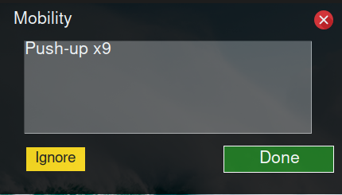

# The Goal
While sitting and working you may not see how the time ends up,
and you've spent hour in uncomfortable position, damaging you spinal health in the long them.
This python program runs in the background and triggers a popup each 20 minutes (by default).
The popup contains suggested exercises for you, you should be honest and to them right away.
If so, press the "Done" button. But, if you're in a meeting or can't do the exercises, you
may press the "Ignore" button and save them for the next time.

## Installation
Clone and git repository and install in virtual environment.
usage `pip install .`
development `pip install -e .`

You can test it by running `mobility` in your console.
 If a popup shown if exercises then everything is correct.

For windows, make sure you install the package as administrator for best experience.

### Windows
In the package directory, type `python src\service install` to install the service.
Make sure you run this as administrator.
  The service checks if the user is away from pc (locked workstation),
  It won't be able to determine if that's the case when the current active process 
  is running as administrator. Therefore, causing in-accurate popups.

Run the serivce.

Failed to run the service?
Try:
    The service uses Win32 API (using pywin32)
    Make sure that:
        you have `pythoncom38.dll` and `pywintypes38.dll` at
        `<python_path>\Lib\site-packages\win32` and
        `<python_path>\Lib\site-packages\win32\lib`

### Linux
install:
    `sudo apt-get install python-tk`
    `sudo apt install gnome-screensaver`

create variable `MOBILITY_PATH` which should lead to the mobility package directory
 and set a crontab to run the script at interval (20 minutes by default)
```
crontab -e
# Add at the top of the file
MOBILITY_PATH=<path_to_mobility_directory>`

# Add at the end of file
*/20 * * * * $MOBILITY_PATH/linux-mobility.sh
```

If you encounter problems with running the mobility package in linux
you can save logs to a desiring file by adding `<path_to_log_file> 2>&1`
to the end of your crontab command

One drawback with the mobility package in linux is that it can't save the state of the exercises.
Unlike windows, the service is running in the background (only reboot or service restart 
my interupt the state). On linux, we use cron, so each run is a fresh new one.

## Configuration
All the configuration is dynamically loaded,
so don't add / remove keys from it, it would make your code not run.

### Exercises
The exercises configuration consist from three elements:
    Must: set of exercises that it is your goal to complete each day.
    Bonus: set of exercises that it would be nice to complete.
    Advanced: set of exercises that used for certain goal (other day stay mobilized)
     for example, to retain strength or increase flexibility.
By default (at least in windows), you will first finished the `must` exercises
and then move to the `bonus` exercises.
The `advanced` exercises are additional exercises that may summon randomly (20% by default).
but if you don't need the advanced exercises you could switch them off, by setting `enabled` to False.

Feel free to change, add or remove exercises to match your body.

### GUI
The GUI configuration is pretty solid,
If you change values, you should be familiar with the library PySimpleGUI.
Either way, you should not change const configuration (all capital letter)
 (if you do, you will need to change the code source as well)

 
